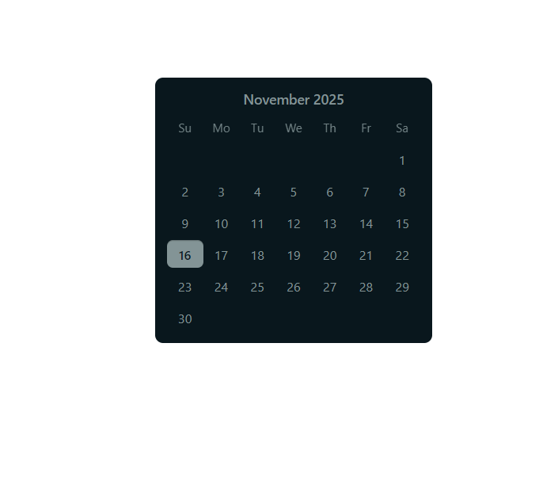

## What I Have Implemented

- Developed a reusable React Calendar component using TypeScript.
- Structured the project by separating logic (utils), types, and UI component for better maintainability.
- Generated the full month matrix dynamically using a custom function.
- Displayed weekday headers, month name, and a clean date grid layout.
- Highlighted the active/selected date based on the provided date prop.
- Added support for custom day rendering using the renderDateCell callback.
- Styled the component using CSS Modules to ensure scoped and clean styling.

Folder Structure
/components/Calendar

- │── Calendar.tsx
- │── WeekRow.tsx
- │── utils.ts
- │── types.ts
- │── Calendar.module.css
- │── Calendar.test.tsx

## Key Features

- Dynamic month generation
- Modular and reusable structure
- Customizable date cell UI
- Clean and simple styling

